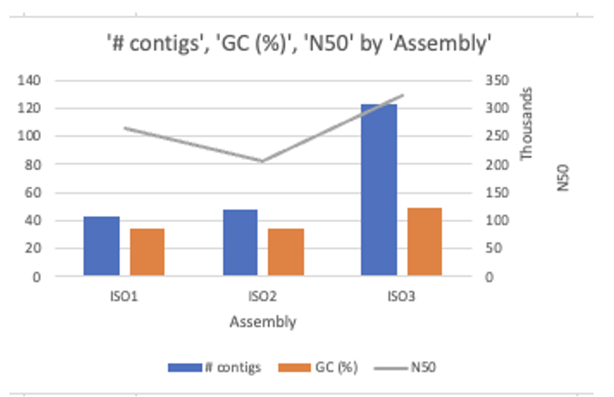

# GeneSequencingAnalysis
## Flavobacteriales DNA sequence Analysis Report
## Oct 29th, 2023
## Raghavi C. Janaswamy 

### Executive Summary: 

Flavobacteriales are family of bacteria that can enable and impair important eco system functions. They are ubiquitous across natural and urban water cycles. This study analyzed the sequences of the cultures of Flavobacteria from raw waste waters. The sequenced DNA from the three isolate cultures: ISO1, ISO2, and ISO3 are the source of inputs in raw FASTQ format. This project enabled the genome assembly in Four steps and provided the reports of analysis. Also, a published genome that is a best match for each dataset is also provided.

### Introduction:

The DNA that was extracted from the cultures of Flavobacteriales, and sequenced in an effort to build the 
Flavobacteria genomes. The goal of this analysis is to find answers for the following. 

a) Is this a cultured bacteria from Flavobacteriales Family
b) Quality assessment and control of the sequence.
c) Assemble the genome and assess the quality of the genome.  
c) Evidence of containing more than one genome
d) Reference to the published genome that is a best match  to each dataset

### Materials and Methods:

####  DNA Sequences: 

The FASTQ files were provided from the DNA Isolates ISO1, ISO2 and ISO3.  

#### Software and Tools: 

a) The FASTQC software used method to evaluate the quality of sequence data. The quality is measured in Q (Phred) Scores. that explains the confident score of the sequencer. 

b) Trimmomatic:  This is used to trim the ends of sequence reads. It is used to detect and remove the artificial sequences such as primer and adapters appended to DNA strands prior to sequencing.

c) SPAdes was used to assemble genomes and to produce contigs (the overlapping regions are read and connected in de Brugin graphs.

d) Quality assessment using QUAST

e) BUSCO to assess the genome quality  and variabiliyt across organisms to reveal the phylogenetic relationships for classification of genomes to species or strains

### Results:

FastQC results that anlayzed the DNA Sequence data as are bellow.

From the 7 files, the pass/Fail of the total attributes are as in Figure 1. FastQC results by File. 

	 

The Basic sequences of the files processed are in the Table 1. Basic Statistics.

	 
      	 
 	 
  	 

 	 
  	 
Table 1. Basic Statistics

The sequences flagged as poor quality are none from all the input sequence files. 

Results from FASTQC, QUAST and BUSCO to write summary report to the engineer
Refer to Module 3 commentary and materials, including the Overview, publications, and websites to help with your analysis. Summarize the quality of the initial sequencing from FastQC, including the Basic Statistics, Per base sequence quality, and Per sequence GC content. 

Next, from QUAST, compare N50 and L50 scores, total number of contigs, and the largest contigs, with a description of metric, and the Nx and GC plots. Lastly, get the genome lineage(s) from BUSCO, and explain the completeness results and figures. Conclude the report with your professional opinion on whther or not the engineer has cultured the bacterium on interest. 

### Genome Assembly

The genome assembly was performed using SPAdes with de Buijin graph approach. The configs in ISO3 was checked using BLAST tool to compare the nearest matching. The Top Result was 
Pseudomonas putida strain B21-029 chromosome, complete genome
Identity = 95.90% match
Query cover = 32%
Title (unpublished): Genome sequences of plant-beneficial Pseudomonas strains with biocontrol activity against various lettuce bacterial pathogens (Biessy, et al., 2022)

### Quality Assessment: 

The quality assessment results using the QUAST tool are compared as below.

The distibution of the contigs lengths of ISO1, ISO2 and ISO3 are depicted in the Nx Plot: Table 2. Nx Plots

 	 	 
 	
Table 2. Nx Plots

The GC content of the contigs are found to be as shown in the Table 3. GC Content 

 
 		  
 	
Table 3. GC Content

The N50, L50 scores, Total contigs, largest contigs, are as detailed in the Table 4. Quast summary for ISO1, ISO2 and ISO3

	 

Table 4. Quast summary for ISO1, ISO2 and ISO3

The Contigs, N40 are reported as in Figure 2. N40, Contigs for Assemblies

	 

### Conclusion

BioProjectID:  CFB group bacteria
Organism Name: Flavobacterium
Environment:
Flavobacterium Bergey et al. 1923 (Approved Lists 1980) emend. Kuo et al. 2013, nom. approb. 1)

The above analysis using various tools and close match search indicates the engineer has cultured the bacterium of interest.

### References

1.	https://busco.ezlab.org/busco_userguide.html#interpreting-the-results
2.	https://www.illumina.com/products/by-type/informatics-products/basespace-sequence-hub/apps/fastqc.html
3.	https://onlinelibrary.wiley.com/doi/abs/10.1002/9781118960608.obm00033

